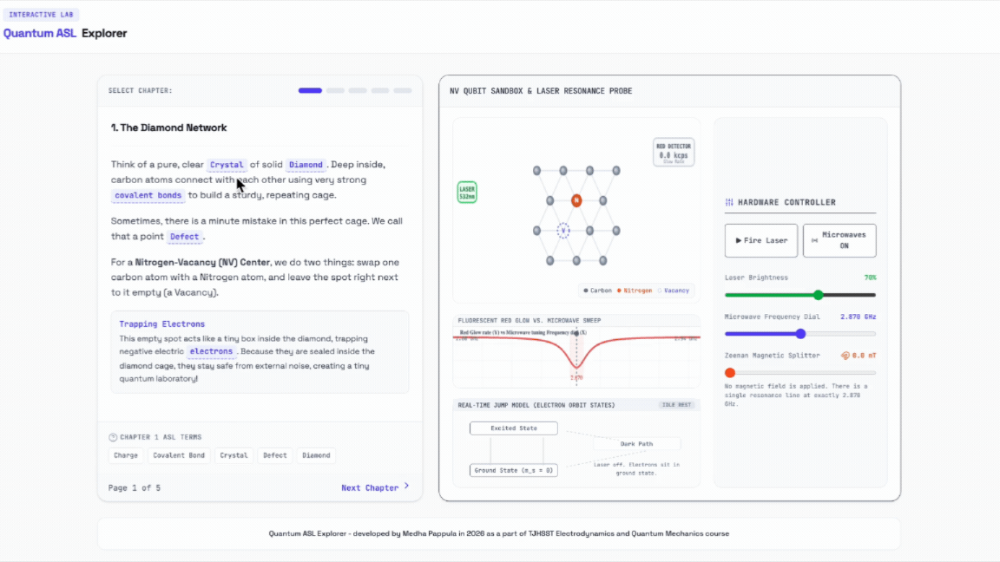

# Quantum ASL Learning Interface

An interactive educational tool that combines quantum physics concepts with ASL-based learning and simulation.

## Overview

This project is designed to make advanced physics more accessible through visual learning, ASL vocabulary, and interaction.

It has two main components:

### 1. Interactive ASL Physics Introduction

Key quantum physics terms are embedded in a long-form introduction. When users hover over a term, an ASL definition video plays showing the meaning of that concept.

### 2. Nitrogen-Vacancy Center Simulation

A simplified visual simulation of a nitrogen-vacancy center in a diamond lattice. Users can trigger a laser pulse and observe state transitions between ground and excited states, along with fluorescence emission.

## Demo

A full walkthrough of both components is available here:

## Data and ASL Attribution

ASL sign and definition videos used in this project come from the **QuantumASL YouTube channel**.

Their work focuses on building ASL vocabulary for quantum science and STEM concepts. It contributes to broader accessibility efforts in science education, including collaborations with institutions such as Gallaudet University and related STEM accessibility initiatives.

All ASL content is used with attribution to QuantumASL. Original videos remain the property of their creators.

## Tech Stack

* HTML
* CSS
* JavaScript
* Video-based ASL overlay system
* Canvas-based simulation (2D)

## Purpose

This project was built as part of an advanced high school physics course to extend classroom concepts into accessible, interactive learning tools.

## License

For educational and demonstration purposes.
